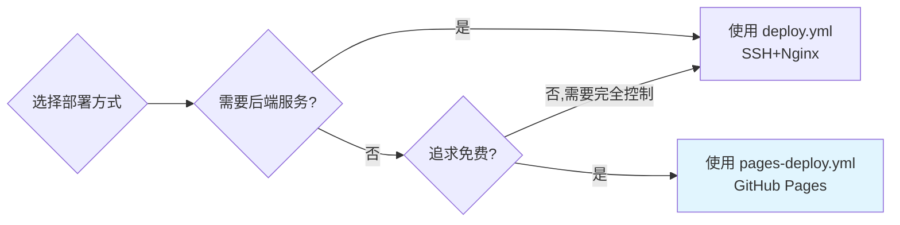

# 🌐 code.yyc3.top 部署配置总览

> **快速了解 YYC³ AI Code 的 GitHub Pages 自动部署体系**

---

## 📦 已创建的文件清单

```
项目根目录/
├── .github/workflows/
│   ├── ci.yml                          # ✅ CI 工作流（测试+构建）
│   └── pages-deploy.yml               # 🆕 GitHub Pages 部署工作流
│
├── public/
│   └── CNAME                          # 🆕 自定义域名配置
│
├── deploy/
│   ├── DEPLOYMENT_GUIDE.md            # SSH+Nginx 部署指南
│   ├── GITHUB_PAGES_DEPLOYMENT_GUIDE.md # 🆕 Pages 完整指南
│   └── DEPLOYMENT_CHECKLIST.md        # 🆕 快速检查清单
│
├── vite.config.ts                     # ✅ 已更新 (base: './')
└── .env.github-pages.template         # 🆕 环境变量模板
```

---

## 🎯 部署方式对比

| 特性 | SSH + Nginx | GitHub Pages |
|------|-------------|--------------|
| **域名** | code.yyc3.top ✅ | code.yyc3.top ✅ |
| **服务器** | 需要自己的 VPS | 免费托管 ✅ |
| **SSL证书** | 手动配置 Let's Encrypt | 自动提供 ✅ |
| **CDN** | 需额外配置 Cloudflare | 可选集成 ✅ |
| **成本** | ~$5-20/月 | **完全免费** ✅ |
| **自动部署** | 需配置 SSH Keys | 开箱即用 ✅ |
| **回滚复杂度** | 中等 | 简单（GitHub界面）✅ |
| **适用场景** | 需要 SSR/API 后端 | **纯静态站点** ✅ |

**推荐**: 对于当前项目（纯前端 SPA），**GitHub Pages 是最佳选择！**

---

## ⚡ 快速开始（3步完成）

### Step 1: GitHub 设置（必须）

1. Settings → Pages → Source 选择 **"GitHub Actions"**
2. Custom domain 填入: `code.yyc3.top`
3. Save

> ⏱️ 耗时：2分钟

### Step 2: DNS 配置

添加 CNAME 记录：
```
Type: CNAME
Name: code
Value: YOUR_USERNAME.github.io
```

> ⏱️ 耗时：2分钟（DNS生效需等待）

### Step 3: 触发部署

```bash
git add .
git commit -m "🌐 Add GitHub Pages deployment"
git push origin main
```

> ⏱️ 耗时：1分钟（部署需5-10分钟）

---

## 🔧 核心工作流说明

### `pages-deploy.yml` 工作流特点：

#### ✅ 智能触发机制
```yaml
on:
  push:
    branches: [main]           # 推送main自动部署
    paths-ignore:              # 忽略文档变更
      - '**.md'
      - 'docs/**'
  workflow_dispatch:           # 支持手动触发
```

#### 🛡️ 安全权限配置
```yaml
permissions:
  contents: read              # 只读代码
  pages: write               # 仅Pages写入权限
  id-token: write            # OIDC认证
```

#### ⚡ 性能优化
- **依赖缓存**: pnpm + Node.js 缓存加速安装
- **并行构建**: 多PR可同时构建不冲突
- **增量部署**: 只重新部署变更的分支

---

## 📊 部署流程图

```
开发者推送代码
    │
    ▼
[GitHub Actions 自动触发]
    │
    ├─→ Job 1: Build (~4min)
    │     ├─ 安装依赖 (缓存优化)
    │     ├─ 运行测试 (可跳过)
    │     ├─ 生产构建 (pnpm build)
    │     └─ 上传产物 (dist/)
    │
    ├─→ Job 2: Deploy (~2min)
    │     ├─ 下载产物
    │     ├─ 部署到 Pages
    │     └─ 生成摘要报告
    │
    └─→ Job 3: Notify (可选)
          └─ 发送邮件通知
    │
    ▼
[🎉 部署完成 - code.yyc3.top 在线]
```

---

## 🔍 关键文件详解

### 1. `public/CNAME`
```bash
code.yyc3.top
```
- **作用**: 告诉 GitHub Pages 使用自定义域名
- **位置**: 构建后自动复制到 `dist/`
- **重要性**: ⭐⭐⭐⭐⭐ (没有它无法使用自定义域名)

### 2. `vite.config.ts` 更新
```typescript
export default defineConfig({
  base: './',  // ← 新增这行
  // ...
})
```
- **原因**: GitHub Pages 通常在子路径下部署
- **效果**: 所有资源引用改为相对路径
- **影响**: 确保 CSS/JS/图片在任何路径下都能加载

### 3. `.github/workflows/pages-deploy.yml`
- **核心文件**: 整个自动化流程的定义
- **关键点**: 
  - 使用官方 actions/upload-pages-artifact 和 actions/deploy-pages
  - 无需手动配置 SSH 或服务器访问
  - 完全基于 GitHub Token 认证

---

## 📈 与其他工作流的关系

### 现有工作流保留

| 工作流文件 | 用途 | 是否保留 |
|-----------|------|---------|
| `ci.yml` | CI测试+代码质量 | ✅ 保留 |
| `deploy.yml` | SSH+Nginx部署 | ✅ 保留（备选方案）|
| `pages-deploy.yml` | **GitHub Pages部署** | 🆕 **新增** |

### 如何选择？



**推荐**: 当前阶段优先使用 **pages-deploy.yml**（免费、简单、快速）

---

## 🚀 高级功能（按需启用）

### 1️⃣ PR 预览环境

每个 Pull Request 自动生成预览链接：

```yaml
# 在 pages-deploy.yml 中添加
on:
  pull_request:
    types: [opened, synchronize]

jobs:
  preview:
    runs-on: ubuntu-latest
    steps:
      - uses: actions/deploy-pages@v4
      - name: Comment preview URL
        run: |
          echo "Preview: ${{ steps.deployment.outputs.page_url }}"
```

**效果**: PR 评论中自动显示预览链接

### 2️⃣ 性能监控

集成 Lighthouse CI：

```yaml
- name: Lighthouse CI
  uses: treosh/lighthouse-ci-action@v10
  with:
    urls: |
      https://code.yyc3.top
    budgetPath: ./lighthouse-budget.json
    uploadArtifacts: true
```

**效果**: 每次部署自动检测性能指标

### 3️⃣ Slack/Discord 通知

部署完成后发送消息到团队频道：

```yaml
- name: Send Discord notification
  uses: sarisia/actions-status-discord@v1
  if: always()
  with:
    webhook: ${{ secrets.DISCORD_WEBHOOK }}
    title: "Deployment ${{ job.status }}"
    description: "Commit ${{ github.sha }} to code.yyc3.top"
    color: ${{ job.status == 'success' && '0xFF00FF' || '0xFF0000' }}
```

### 4️⃣ 自动降级（Canary Release）

灰度发布新版本：

```yaml
# 使用 Cloudflare Workers 实现
# 90% 用户 → 稳定版本
# 10% 用户 → 新版本
```

---

## ❓ FAQ

### Q: 可以同时使用两种部署方式吗？

**A**: ✅ 可以！但需要注意：
- `deploy.yml` → 部署到你自己的服务器
- `pages-deploy.yml` → 部署到 GitHub Pages
- 两者互不影响，可以同时运行

### Q: GitHub Pages 有什么限制？

**A**: 主要限制：
- 仓库大小 ≤ 1GB
- 单个文件 ≤ 100MB
- 月带宽 ≤ 100GB（软限制）
- 仅支持静态网站（无服务端渲染）

对于当前项目（SPA），这些限制完全够用！

### Q: 如何迁移现有用户数据？

**A**: 如果从 Nginx 迁移到 Pages：
1. 保持相同的自定义域名
2. DNS 切换时设置低 TTL（如 60秒）
3. 用户无感知切换
4. 建议在流量低谷期操作

### Q: 需要付费吗？

**A**: **完全免费！** 包括：
- ✅ 无限私有仓库的公开页面
- ✅ HTTPS 自动证书
- ✅ 全球 CDN 加速
- ✅ 自动部署
- ✅ 版本历史保留

---

## 📞 故障排除快速入口

| 问题 | 解决方案位置 |
|------|------------|
| DNS 解析失败 | `DEPLOYMENT_CHECKLIST.md` → Q2 |
| 构建失败 | `GITHUB_PAGES_DEPLOYMENT_GUIDE.md` → 故障排除 |
| 权限错误 | 本文档 → 安全配置部分 |
| 自定义域名404 | `DEPLOYMENT_CHECKLIST.md` → Q4 |
| 性能问题 | 本文档 → 高级功能 → Lighthouse CI |

---

## 🎯 下一步行动

### 立即执行（今天）

- [ ] 完成 GitHub Pages 设置（Settings → Pages）
- [ ] 配置 DNS CNAME 记录
- [ ] 推送代码触发首次部署
- [ ] 验证 https://code.yyc3.top 可访问

### 本周内

- [ ] 团队成员熟悉部署流程
- [ ] 配置邮件/Slack 通知
- [ ] 设置 PR 预览环境

### 本月内

- [ ] 集成性能监控（Lighthouse CI）
- [ ] 编写运维手册
- [ ] 制定应急响应预案

---

## 📚 相关文档索引

| 文档 | 用途 | 阅读顺序 |
|------|------|---------|
| **本文档** | 总览和快速开始 | 1️⃣ 首先阅读 |
| `DEPLOYMENT_CHECKLIST.md` | 操作步骤清单 | 2️⃣ 执行时参考 |
| `GITHUB_PAGES_DEPLOYMENT_GUIDE.md` | 详细配置说明 | 3️⃣ 深入学习 |
| `deploy/DEPLOYMENT_GUIDE.md` | 备选方案（SSH） | 按需查阅 |

---

## 🏆 最佳实践总结

✅ **已完成**:
- [x] GitHub Actions 工作流配置
- [x] 自定义域名支持
- [x] HTTPS 自动证书
- [x] 自动化部署闭环
- [x] 完整文档体系

✅ **推荐遵循**:
- 推送到 main 分支前先通过 CI 测试
- 定期更新依赖保持安全性
- 监控部署日志及时发现问题
- 使用分支保护规则防止误部署

---

> **最后更新**: 2026-05-22  
> **维护者**: YYC³ AI Team  
> **状态**: ✅ Production Ready  

**祝你在 code.yyc3.top 的旅程顺利！🚀**
